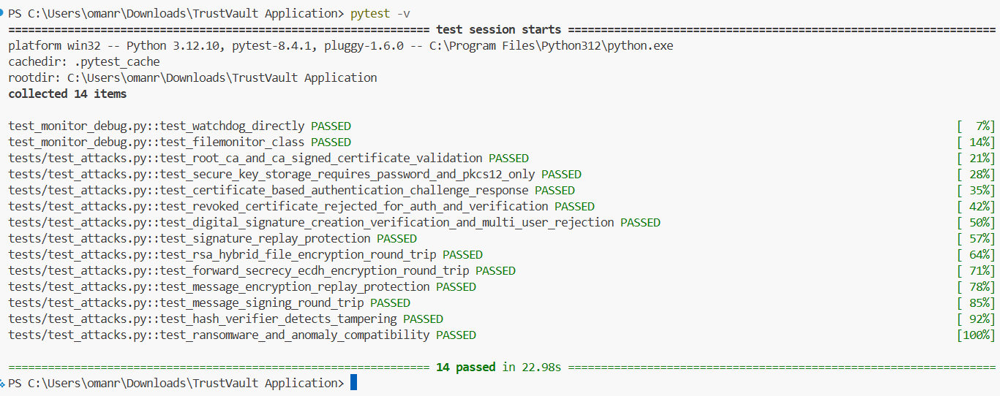

# TrustVault:
TrustVault is a PKI-based real-time cryptographic monitoring system that uses certificate-based authentication, digital signatures, and asymmetric encryption to secure data and verify user identity. It continuously monitors files for integrity violations and ransomware-like behavior, logs security events, and triggers real-time alerts via email. The system also provides GUI, CLI, and web dashboard interfaces.


# Key Features:
- PKI-based certificate management
- Root CA and CA-signed user certificates
- RSA and ECC key generation
- Password-protected PKCS#12 keystore support
- Digital signature creation and verification
- File and message encryption/decryption
- Replay attack protection using timestamps and nonces
- Certificate revocation checking
- File integrity monitoring with SHA-256 hashes
- Real-time filesystem monitoring
- Ransomware and anomaly detection
- Audit logging for security events
- Multi-user account management
- Graphical User Interface, Command-Line Interface, and Web Dashboard
- Automated testing with pytest


# Tech Stack:
1. Python – Core programming language
2. Tkinter – Desktop graphical user interface (GUI)
3. Flask – Web dashboard and monitoring interface
4. Cryptography – RSA, ECC, X.509 certificates, PKCS#12, AES-GCM, ECDH, HKDF, and digital signatures
5. Watchdog – Real-time file system monitoring
6. SHA-256 – File integrity verification
7. JSON – Configuration, user data, logs, and application state storage
8. Pytest – Automated testing


# High-Level Architecture:
                           User
                             │
              ┌──────────────┴──────────────┐
              │                             │
              ▼                             ▼
        GUI (Tkinter)                 CLI Interface
              │                             │
              └──────────────┬──────────────┘
                             │
                             ▼
                    TrustVault Application
                             │
        ┌────────────────────┼────────────────────┐
        │                    │                    │
        ▼                    ▼                    ▼
  PKI & Security       Monitoring Engine     Dashboard & Alerts
        │                    │                    │
        ├─ Root CA           ├─ File Monitoring   ├─ Web Dashboard
        ├─ Certificate Mgmt  ├─ SHA-256 Checks    ├─ Email Alerts
        ├─ PKCS#12 Keys      ├─ Ransomware Detect └─ Audit Logging
        ├─ Authentication    └─ Anomaly Detection
        ├─ Digital Signatures
        ├─ Encryption/Decryption
        └─ Replay Protection
                             │
                             ▼
                     Data & Log Storage
             (Certificates, Keys, Users, Logs,
              Configuration, Audit Records)


# TrustVault Structure:
TrustVault Application/
├── .github/
├── alerts/
├── backups/
├── certs/
├── communication/
├── config/
├── CSV_logs/
├── data/
├── gui/
├── keys/
├── logs/
├── monitoring/
├── security/
├── tests/
├── utils/
├── .dockerignore
├── CONTRIBUTING.md
├── data_setup.py
├── docker-compose.yml
├── Dockerfile
├── file_monitor.log
├── install_dependencies.py
├── LICENSE
├── main.py
├── README.md
├── requirements.jl
├── run.py
├── securefim_cli.py
├── test_monitor_debug.py
└── update_license.py


# Login Details:
1. 
- Username: omanryne_login
- Account Password: TrustVault@2026
- PKCS#12 Keystore Password: TrustVault@2026
- PKCS#12 Keystore: C:\Users\omanr\Downloads\TrustVault Application\keys\omanryne_login.p12

2. 
- Username: omanryne
- Account Password: omanryne
- PKCS#12 Keystore Password: omanryne
- PKCS#12 Keystore: C:\Users\omanr\Downloads\TrustVault Application\keys\omanryne.p12

# Running the Application:
Start the desktop application:

```bash
python main.py
```

Or launch using:

```bash
python run.py


# Testing:
Run all tests:
```bash
pytest
```
Current status:
- 14 tests passing


# License:
This project is licensed under the MIT License.